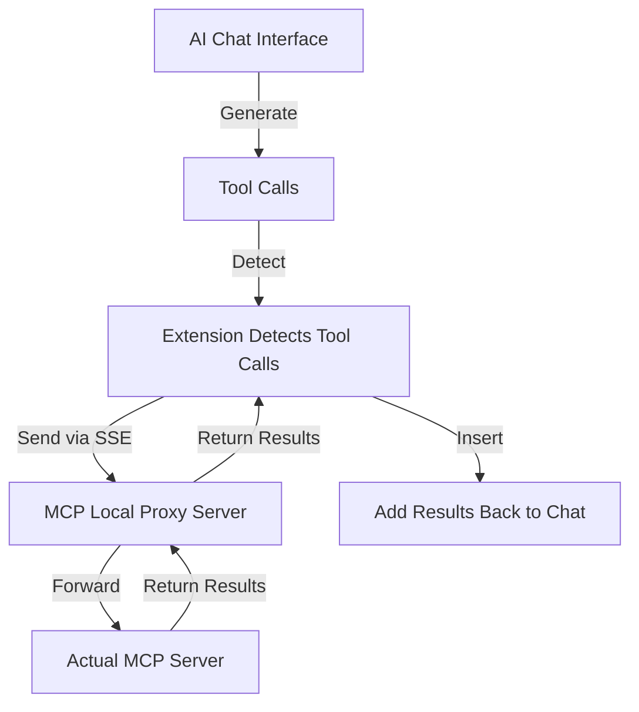

<div align="center">
   <h1>MCP SuperAssistant Chrome Extension</h1>
</div>

<p align="center">
Brings MCP to ChatGPT, Perplexity, Grok, Gemini, Google AI Studio, OpenRouter, Kimi, GitHub Copilot, Mistral, and more...
</p>

<p align="center">
   <a href="https://mcpsuperassistant.ai/" target="_blank"><strong>🌐 Visit Official Website</strong></a>
</p>

<!--  -->
<div align="center">
 
</div>

<div align="center">
    
   
   
   

</div>

## Installation

> **Note:** This extension has not been published to the Chrome Web Store or Firefox Add-ons yet. Use the manual installation instructions below.

### Manual Installation (Development)

#### Release Version
1. Download the latest release from [Releases](https://github.com/munir-abbasi/MCP-SuperAssistant-updated/releases)
2. Unzip the downloaded file
3. Navigate to `chrome://extensions/` in Chrome
4. Enable "Developer mode"
5. Click "Load unpacked" and select the unzipped directory
6. Follow [Connecting to Local Proxy Server](#connecting-to-local-proxy-server) to connect to your MCP server

To work on the source instead, see [Development](#development) below.

## Overview

MCP SuperAssistant is a Chrome extension that brings Model Context Protocol (MCP) tools into AI chat sites (Perplexity, ChatGPT, Google Gemini, Google AI Studio, Grok, and others). The extension spots a tool call in the chat, runs it against your MCP server, and puts the result back into the conversation without you leaving the page.

### The system model

The extension is a **closed loop around one operation**: a tool call shows up, the extension forwards it to an MCP server, the result comes back, and the result lands in the conversation. The renderer, the content script, the background service worker, the MCP client, the transport plugins, the site adapters — all of them exist to carry that one operation through. Each component owns a narrow set of source facts that feed the operation's agent-facing lenses, and the operation itself is the unit of reasoning.

An agent driving this system reasons about the operation first, then follows provenance to the smallest authoritative source set that can answer its question. That is what makes the system inspectable and repairable: ownership, impact, evidence, and write-back paths are explicit, and every runtime boundary has one authoritative documentation locus plus a deterministic route to the smallest relevant evidence or observation surface.

> **Current development-tree safety qualification (2026-09-23):** the repository does not yet establish exactly-once semantics for external-effecting MCP tool calls. The previously identified hidden `mcp:call-tool` redispatch path in the generic content/background message bridge is repaired (hard single-dispatch at the bridge boundary), but a timeout/retry outcome still leaves the server-side effect unknown, and formal effect-class/action admission remains open. Until that contract is qualified, avoid treating Auto-Execute or a timeout/retry outcome as safe for non-idempotent writes where a duplicate external effect would matter.

## Registered Adapter Platforms

The registry ships dedicated adapters for the platforms below. The current qualification
evidence is a dated, scoped ChatGPT snapshot; on its own it does **not** qualify a later
source revision or packaged artifact. Every other registered site adapter stays
experimental or unsupported until someone verifies it.

- [ChatGPT](https://chatgpt.com/)
- [Google Gemini](https://gemini.google.com/)
- [Perplexity](https://perplexity.ai/)
- [Grok](https://grok.com/)
- [Google AI Studio](https://aistudio.google.com/)
- [OpenRouter Chat](https://openrouter.ai/chat)
- [DeepSeek](https://chat.deepseek.com/)
- [T3 Chat](https://t3.chat/)
- [GitHub Copilot](https://github.com/copilot)
- [Mistral AI](https://chat.mistral.ai/)
- [Kimi](https://kimi.com/)
- [Qwen Chat](https://chat.qwen.ai/)
- [Z Chat](https://chat.z.ai/)


## Demo Video

Kimi.com

[](https://www.youtube.com/watch?v=jnBPh2jzunM)

ChatGPT

[](https://www.youtube.com/watch?v=PY0SKjtmy4E)

[MCP SuperAssistant Demo Playlist](https://www.youtube.com/playlist?list=PLOK1DBnkeaJFzxC4M-z7TU7_j04SShX_w)

## Setup Tutorial

[](https://www.youtube.com/watch?v=h9f_GX1Ef20&pp=ygUTbWNwIHN1cGVyIGFzc2lzdGFudA%3D%3D)

**First time here?** Watch the setup guide before you start.

[View Setup Tutorial](https://www.youtube.com/watch?v=h9f_GX1Ef20&pp=ygUTbWNwIHN1cGVyIGFzc2lzdGFudA%3D%3D)

## What is MCP?

The Model Context Protocol (MCP) is an open standard from Anthropic that connects AI assistants to systems where data actually lives: content repositories, business tools, development environments. AI systems use it to interact with those data sources live, securely, over one shared protocol.

## Key Features

- **Multiple AI Platform Adapters**: ChatGPT, Perplexity, Google Gemini, Grok, Google AI Studio, OpenRouter Chat, DeepSeek, T3 Chat, GitHub Copilot, Mistral AI, Kimi, Qwen Chat, and Z Chat; qualification status varies by site
- **Tool Detection**: the extension finds MCP tool calls in AI responses
- **Tool Execution**: one click runs the tool
- **Tool Result Integration**: results go back into the AI conversation
- **Render Mode**: renders function calls and their results
- **Auto-Execute Mode**: detected tools run without a click
- **Auto-Submit Mode**: chat input submits itself right after the results go in
- **Push Content Mode**: push page content instead of overlaying it
- **Preferences Persistence**: sidebar position, size, and settings stick around
- **Dark/Light Mode Support**: the sidebar follows the AI platform's theme



### Connecting to Local Proxy Server

The extension reaches your MCP servers through a local proxy. The proxy is a standalone npm package the original author publishes; it is not bundled with the extension, works with any fork, and you never need to publish your own.

#### Run MCP SuperAssistant Proxy via npx:

1. Create a `config.json` file with your MCP server details. For example, to use the [Desktop Commander](https://github.com/wonderwhy-er/DesktopCommanderMCP):


   **Example config.json:**
   ```json
   {
     "mcpServers": {
       "desktop-commander": {
         "command": "npx",
         "args": [
           "-y",
           "@wonderwhy-er/desktop-commander"
         ]
       }
     }
   }
   ```
   config.json also accepts other MCP server configurations, such as remote MCP server URLs.
   Try Composio MCP, Zapier MCP, Smithery, or any other remote MCP server.

   **Or use existing config file location from Cursor or other tools:**
   ```
   macOS: ~/Library/Application Support/Claude/claude_desktop_config.json
   Windows: %APPDATA%\Claude\claude_desktop_config.json
   ```

2. Start the MCP SuperAssistant Proxy server using one of the following commands:

   ```bash
   npx -y @srbhptl39/mcp-superassistant-proxy@latest --config ./config.json --outputTransport sse
   ```
   or 
   ```bash
   npx -y @srbhptl39/mcp-superassistant-proxy --config ./config.json --outputTransport streamableHttp
   ```
   or
   ```bash
   npx -y @srbhptl39/mcp-superassistant-proxy --config ./config.json --outputTransport ws
   ```

   **View all available options:**
   ```bash
   npx -y @srbhptl39/mcp-superassistant-proxy@latest --help
   ```
   
   The proxy earns its keep when you need to:
   - Proxy remote MCP servers
   - Add CORS support to remote servers
   - Watch health endpoints for monitoring

#### Connection Steps:

1. Start the proxy server using one of the commands above
2. Open the MCP SuperAssistant sidebar in one of the supported AI platforms — the sidebar UI should appear
3. Click on the server status indicator (usually showing as "Disconnected")
4. Enter the local server URL (default: `http://localhost:3006/sse`)
   URL format depends on the --outputTransport method used:
   - For SSE: `http://localhost:3006/sse`
   - For Streamable HTTP: `http://localhost:3006/mcp`
   - For WebSocket: `ws://localhost:3006/message`
   - Pick the transport method you started the proxy with (SSE, Streamable HTTP, or WebSocket)
   - You can also paste any remote MCP server URL here, as long as it handles CORS or runs through this proxy. Try [Composio MCP](https://mcp.composio.dev/), [Zapier MCP](https://zapier.com/mcp), or [Smithery](https://smithery.ai/), or any other remote MCP server.
5. Click "Connect"
6. The indicator turns "Connected" when the handshake succeeds

## Usage
Example Workflow:
1. Navigate to a supported AI platform, e.g., ChatGPT.
2. The MCP SuperAssistant sidebar appears on the right side of the page
3. Configure your MCP Tools to enable and disable the tools you want to use.
4. In the message prompt area, hover the 'MCP' button to see the available tools and their descriptions.
5. Add an MCP working instructions prompt to the chat to inform the AI about its new capabilities and how to use the tools. Use the 'Insert' or attach button to add the instructions.
6. Once the instructions are added, you can ask the AI to read files or perform any related MCP tool operations.
7. When the AI wants to use a tool, it shows a tool call card with the tool name and parameters.
8. You can run the tool call yourself with the "RUN" button on the card, or let Auto-Execute mode run it for you.
9. For full automation, open the 'MCP' button and turn on Auto-Execute and Auto-Submit.


## Tips & Tricks

1. **Turn off search mode** (ChatGPT, Perplexity) in AI chat interfaces so tool calls come out cleaner and MCP SuperAssistant doesn't get derailed.
2. **Turn on Reasoning mode** (ChatGPT, Perplexity, Grok) in AI chat interfaces — it helps the AI understand the context and generate correct tool calls.
3. Use newer high-end models; they understand context better and write correct tool calls more often.
4. Copy the MCP instructions prompt and paste it in the AI chat system prompt (Google AI Studio).
5. Mention the specific tools you want to use in your conversation.
6. The MCP Auto toggles control when tools run.

## Common Issues with MCP SuperAssistant

### 1. Extension Not Detecting Tool Calls

- Make sure the extension is enabled in your browser.
- Check that the **mcp prompt instructions are properly attached or inserted** in the chat before you start.
- Check that your AI platform supports tool calls and that the feature is enabled.
- Refresh the page or restart your browser if the issue persists.

### 2. Tool Execution Fails

- Ensure your proxy server is running and the URL is correct in the sidebar server settings.
- Check your config.json file for any errors or formatting issues.
- Check your network connectivity and firewall settings.

### 3. Connection Issues

- Ensure that your MCP server is running and accessible.
- Check the server URL in the extension settings.
- First start the npx proxy server, then reload/restart the extension from the `chrome://extensions/` page.
- Check the proxy server logs for any errors or issues.
- Ensure that your firewall or antivirus software is not blocking the connection.
- Make sure the server shows the proper connected status and exposes the `/sse` endpoint.

### 4. Incorrect tool call format 

- Sometimes the model writes a tool call in the wrong format, and detection fails. Use a model built for tool calling when that happens.
- Use the custom instructions prompt, which can be found in the MCP SuperAssistant sidebar.
- Ask explicitly to use the tools by mentioning them in the prompt.
- The extension renders the correct function call format like this:

```jsonl
{"type": "function_call_start", "name": "function_name", "call_id": 1}
{"type": "description", "text": "Short 1 line of what this function does"}
{"type": "parameter", "key": "parameter_1", "value": "value_1"}
{"type": "parameter", "key": "parameter_2", "value": "value_2"}
{"type": "function_call_end", "call_id": 1}
```

## Development

### Prerequisites

- Node.js >=22.12.0 (pinned in `.nvmrc`; hosted CI runs this exact version)
- pnpm 9.15.1 (pinned via `packageManager` in `package.json`)

### Setup

```bash
# Install dependencies
pnpm install

# Start development server
pnpm dev

# Build for production
pnpm build

# Create zip package for distribution
pnpm zip
```

### Verification

Run the local gates before every push:

```bash
pnpm type-check                          # TypeScript across all packages
pnpm --filter chrome-extension test      # node test suite
pnpm lint                                # eslint across all packages
```

`pnpm prettier` checks formatting, and `pnpm zip` builds the packaged extension artifact
for distribution.

## Contributing

Contributions are welcome — open a pull request.

1. Fork the repository
2. Create your feature branch (`git checkout -b feature/amazing-feature`)
3. Commit your changes (`git commit -m 'Add some amazing feature'`)
4. Push to the branch (`git push origin feature/amazing-feature`)
5. Open a Pull Request

## Authors

### Original Author

- **[Saurabh Patel](https://github.com/srbhptl39)** — Original creator and maintainer of MCP SuperAssistant

### This Repository

- **[Munir Abbasi](https://github.com/munir-abbasi)** — Fork maintainer, updates, and improvements

## Sponsor & Support

This repository is a maintained fork of the original [MCP SuperAssistant](https://github.com/srbhptl39/MCP-SuperAssistant) by Saurabh Patel.

**Support the original project:**
- ⭐ [Star the original repo](https://github.com/srbhptl39/MCP-SuperAssistant)
- 💖 [Sponsor Saurabh Patel on GitHub](https://github.com/sponsors/srbhptl39)

## Improvements Over the Original

What this fork changes compared with the upstream [MCP SuperAssistant](https://github.com/srbhptl39/MCP-SuperAssistant):

- **Truthful connection and discovery state.** Content state uses `disconnected`, `connecting`, `connected`, `error`, and `reconnecting`. When tool discovery fails, you see it, and the MCP client leaves the connected state.
- **CSP-safe validation.** AJV runtime code generation is gone, replaced by `@cfworker/json-schema`. No `unsafe-eval`, no `new Function`, no CSP violations.
- **Bounded failure.** One malformed tool schema no longer hides every valid tool. Partial discovery tells you which capabilities failed, and tool output errors stay visible and bounded.
- **Active-call cancellation.** Disconnect rejects active tool calls, and you can cancel explicitly with `AbortSignal`.
- **Streamable HTTP fixes.** Correct JSON and SSE-framed tool discovery, proper `Accept` and session headers, fragmented chunk handling.
- **MCP protocol preservation.** `outputSchema`, `annotations`, `structuredContent`, and other valid MCP fields survive instead of getting stripped.
- **Hardened site adapter contract.** Every supported site adapter follows the same rules: idempotent mounting, SPA navigation survival, semantic selectors, verified insertion and submission, clean teardown.
- **Chrome/Firefox qualification evidence.** A packaged Chrome/Firefox-on-Linux qualification snapshot dated 2026-07-30 was recorded. Revalidate after relevant source, build, or browser changes before describing a newer artifact as qualified. Firefox conversion retains Manifest V3 in the current implementation.
- **Payload safety.** Explicit size budgets, no megabyte-base64 DOM injection, bounded previews for oversized results.
- **Deterministic testing.** Regression tests come before every fix, the core flow runs in a real browser, and release artifacts carry integrity-checked SHA-256 hashes.
- **Issue-ledger discipline.** 79 upstream issues were classified against this fork with evidence-based fix status (Fixed/Partial/Open/Won't Fix), code references, and reproduction notes.

## Upstream Issues Status

Key fixes already applied in this fork:

| Issue | Status |
|-------|--------|
| `outputSchema` breaks tool discovery (#199, #191, #196) | ✅ Fixed |
| CSP `unsafe-eval` blocks schema compile (#171) | ✅ Fixed |
| SSE reconnect "Already connected" (#194, #184, #183) | ✅ Fixed |
| `keyValidator._parse is not a function` (#158) | ✅ Fixed |
| Historical runaway re-execution loop (#155) | ✅ Fixed in the scoped upstream-issue audit; separate generic `mcp:call-tool` timeout redispatch repaired 2026-09-12 (hard single-dispatch at the bridge boundary); exactly-once server effects remain out of scope |
| Qwen not working (#148) | ✅ Fixed |
| Frequent SSE disconnections (#68) | ✅ Fixed |
| Invalid enum value `'sse'` (#81) | ✅ Fixed |

## License

This project is licensed under the MIT License. See [LICENSE](LICENSE) for details.

The original work is Copyright (c) 2025 Saurabh Patel. Modifications and updates in this fork are Copyright (c) 2026 Munir Abbasi, distributed under the same MIT terms.

## Acknowledgments

- [Saurabh Patel](https://github.com/srbhptl39) for creating the original MCP SuperAssistant
- Inspired by the [Model Context Protocol (MCP)](https://modelcontextprotocol.io/) by Anthropic
- Thanks to [Cline](https://github.com/cline/cline) for idea inspiration
- Built with [Chrome Extension Boilerplate with React + Vite](https://github.com/Jonghakseo/chrome-extension-boilerplate-react-vite)
